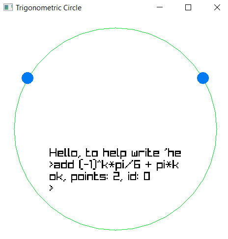
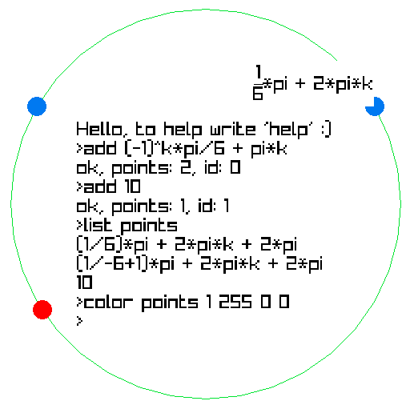

# Trigonometric Circle
## C++ and [Raylib](https://github.com/raysan5/raylib) ([install](https://github.com/raylib-extras/game-premake))

# About the project

With this program, you can see the specific points of a particular solution on a trigonometric circle.

For example, you need to find out which points are encrypted in add (-1)^k * pi/6 + pi*k.
Just enter ```add (-1)^k*pi/6 + pi*k``` and we see:



# How to manage?

To see the name of a point, you need to hover the cursor over it

For the rest of the control, there is a self-written console in the center.



## Opportunities

It is possible not only to add and remove points, but also:
- change the color (solutions, console, circle)
- hide/show solutions
- view all the points and solutions that you have added
- change the font size (if it is too large or small)

## Specific commands

### add solving:string

Add a solution (can be write by a space)

### clear

Removes all added solutions

### color console|circle r:int g:int b:int

Changes the color of the console|circle to <rgb>

### color points id:int r:int g:int b:int

Changes the color of the solution with <id> to <rgb>

### delete id:int

Remove the solution with <id> (all others will not change their id)

### exit

Close applications (you can click on the X or ESC)

### help

Display a list of all commands with a brief description

### help command:string

Display information about <command>

### hide id:int

Hide all solution points

### list points

Print all points

### list solving

Display all solutions with their id

### set_font_size size:int

Set the font size of the console

### show id:int

Display all solution points

# A little bit about the files

## Math (.hpp/.cpp)

The logic of converting a string into an "understandable" expression (if you remove ```get_ans``` method everywhere, then a completely independent module)

## LikeConsole (.hpp/.cpp)

They contain all the logic of the console (and some commands). This is a completely independent module (though raylib is needed)

## Points (.hpp/.cpp)

Everything about a point (not its name) and the circle

## NamePoint (.hpp/.cpp)

The logic of displaying the point name (both in the console and on the screen). The name of the main class (Ans) is stupid, but I realized it when it was too late

## MyCommand (.hpp/.cpp)

All other commands

## main.cpp

Just ```void main();```

[Ru ReadMe](https://github.com/3NikNikNik3/TrigonometricCircle/blob/main/ReadMe.md)
